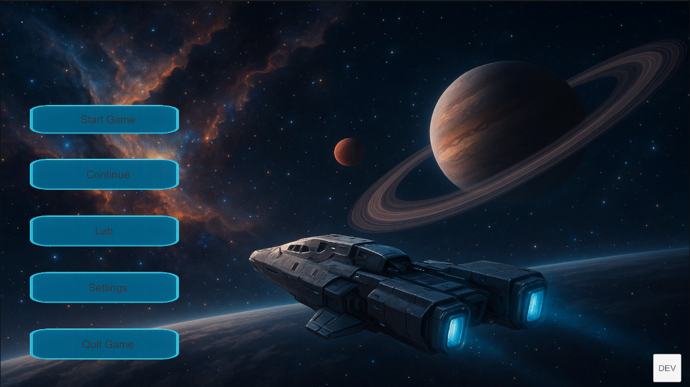
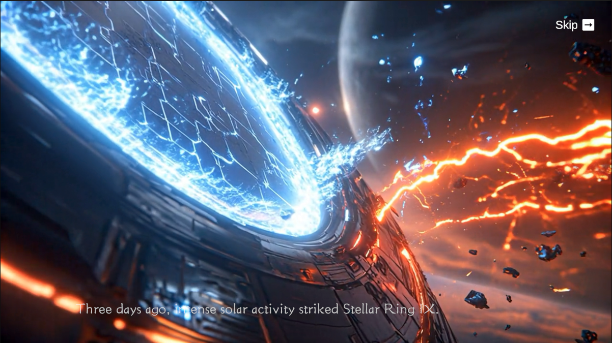
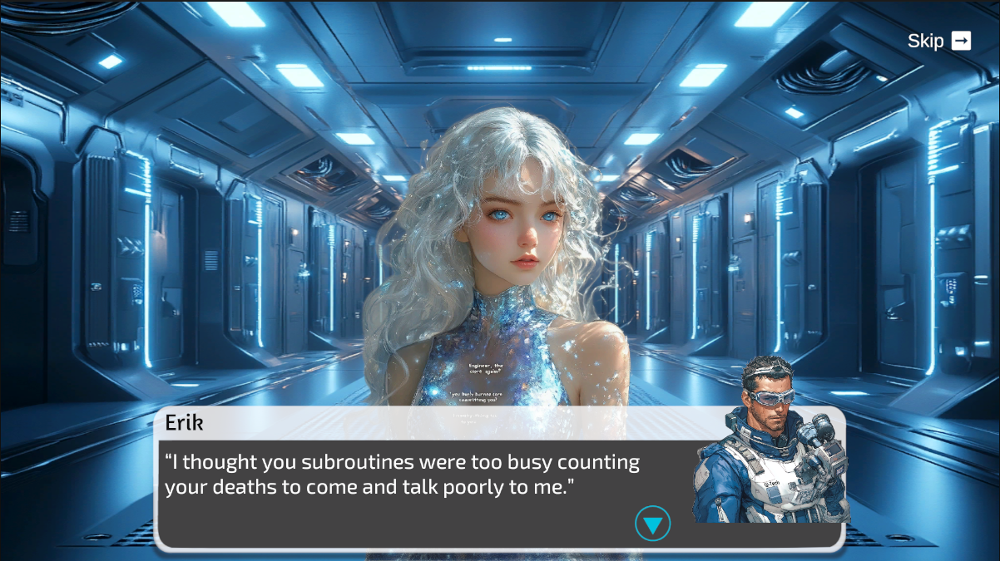
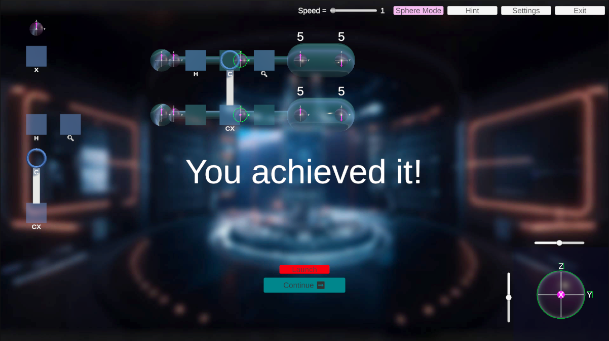

# Quantum Storm: Exploring Quantum Computing Through Play

## Overview

**Quantum Storm** is an educational Unity game that turns the abstract mathematics of quantum computing into an interactive, narrative-rich experience.

Players board a damaged space station and must master qubits, superposition, entanglement and quantum gates to avert disaster—learning core concepts without needing advanced maths.

## Download

- link: https://github.com/wufeng1740/Quantum-Storm/releases

- system: for Windows and Mac

## Screenshots

- Main Menu

- Story 0

- Main Charecters

- Game Level

## Developers

- Feng Wu
- Kuirui Wang
- Mu Sha
- Jiaqi You
- Zhenlu Shan
- Lirui Zhang
